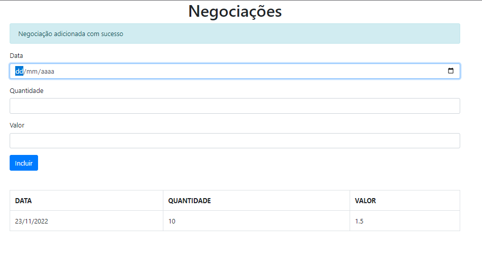

<h1>Projeto para formação em Typescript da Alura</h1>
<h2><b>Projeto para aprendizagem da linguagem Typescript, aplicando principalmente o paradigma de 
Orientação a Objetos.</b></h2> 

<h3> <b>🎖️ Curso 1 - Evoluindo seu JavaScript.</b></h3>

 - Fundamentos e Compilador
 - Typagem Estática
 - Model e Controller

<h3> <b>🎖️ Curso 2 - Avançando na linguagem.</b></h3>

 - Classes
   - Herança e Reaproveitamento de Código
   - Views
   - Visibilidade de metodos e Enumerations
 - StrictNullCheck

<h3> <b>🎖️ Curso 3 - Técnicas e Boas Práticas.</b></h3>

 - Desenvolvimento dos **Decorators** para métodos
   - Inspect (Para acompanhar performance)
   - Escape (Para tratar qualquer script incluso não desejado.)

 - Decorators para Propriedades
 
<h3>Exemplos do Projeto.</h3>
<h5> - Pagina Principal.</h5>

